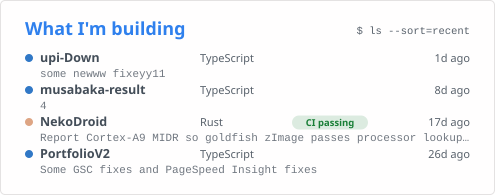
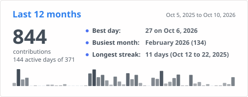
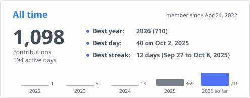
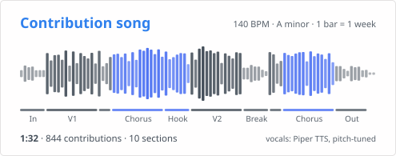

# Nishal K

Full-stack developer · AMV editor · Music producer · Malappuram, Kerala

## About me

I'm a full-stack developer from Kerala. I build web, desktop and terminal apps with TypeScript, React, Rust and Python, and I put most of them online with a live link so people can use them. Right now most of my time goes into NekoDroid, an Android emulator that runs in the browser. Away from code, I edit AMVs and produce remixes in FL Studio.

> A beat has to land on time. Your code should too. I put the same care into both.

## Current focus: NekoDroid

[NekoDroid](https://github.com/nishal21/NekoDroid) is an Android emulator that runs entirely in a browser tab. I'm writing it from scratch in Rust and compiling it to WebAssembly, so there is no server or remote VM involved.

- ARMv7 CPU core (ARM and Thumb) with CP15 and an MMU
- Dalvik interpreter that loads and runs a small test APK
- Linux boot path that is partway through bringing up an Android goldfish kernel
- MIT licensed, 140 passing tests, and a [development log](https://github.com/nishal21/NekoDroid/blob/main/DEVLOG.md) covering every work session

It does not run Play Store apps yet. The [project README](https://github.com/nishal21/NekoDroid#what-works-today) lists what works today.

## What I'm building

My most recently active public repos and their latest commits. A GitHub Action refreshes both cards every night.

  <picture>
    <source media="(prefers-color-scheme: dark)" srcset="assets/building-dark.svg">
    <source media="(prefers-color-scheme: light)" srcset="assets/building-light.svg">
    
  </picture>
  <picture>
    <source media="(prefers-color-scheme: dark)" srcset="assets/commits-dark.svg">
    <source media="(prefers-color-scheme: light)" srcset="assets/commits-light.svg">
    
  </picture>

## Selected projects

| Project | Description | Stack | Link |
|:--|:--|:--|:--|
| [NekoBeat](https://github.com/nishal21/NekoBeat) | Finds and plays music from several sources in one app. | Tauri, React, Rust | [Website](https://nishal21.github.io/NekoBeat-Website/) |
| [Publicolio](https://github.com/nishal21/Publicolio) | Turns a GitHub profile into a portfolio site you can theme and share. | React, TypeScript | [App](https://app.publicolio.qzz.io/) |
| [World News CLI](https://github.com/nishal21/News-CLI) | Full-screen terminal news reader with optional AI summaries and text-to-speech. | Python, Textual | [PyPI](https://pypi.org/project/worldnews-cli/) |
| [Extracto](https://github.com/nishal21/Extracto) | Returns structured data from a URL and a plain description of what you want. | Python, Playwright | [Website](https://nishal21.github.io/Extracto/) |
| [Sigil-extractor](https://github.com/nishal21/Sigil-extractor) | Hides license proofs inside datasets with cryptographic steganography and verifies them later. | Rust, Tauri, Svelte | [Website](https://nishal21.github.io/Sigil-extractor/) |
| [CarbonLint](https://github.com/nishal21/CarbonLint) | Tracks your system's energy use in real time and estimates its carbon footprint. | JavaScript | [Website](https://nishal21.github.io/CarbonLint/) |
| [UPI Down](https://github.com/nishal21/upi-Down) | Shows which banks and UPI apps people are reporting as down. No login. | TypeScript | [App](https://upidown.nishal.dev) |
| [Weather](https://github.com/nishal21/weather) | Hourly and 7-day forecasts, rain, UV and air quality for cities in India and abroad. | Next.js, TypeScript | [App](https://weather.nishal.dev/) |

More projects are on my portfolio at [nishal.dev](https://nishal.dev).

## Tech I use

I mostly write TypeScript and JavaScript, plus Rust, Python and Go for systems work, CLIs and side projects. On the web that means React, Next.js, Vite and Tailwind CSS. I use Tauri for desktop apps, WebAssembly for NekoDroid, and Textual and Playwright on the Python side.

## Latest blog posts

<table>
<thead><tr><th align="left">Post on dev.to</th><th align="left" width="120">Published</th></tr></thead>
<tbody>
<!-- BLOG:START --><tr><td><a href="https://dev.to/nishal21/i-built-a-full-screen-news-reader-that-lives-in-the-terminal-jmp">I built a full-screen news reader that lives in the terminal</a></td><td>Jul 31, 2026</td></tr><tr><td><a href="https://dev.to/nishal21/i-built-a-zero-config-100-serverless-portfolio-generator-so-you-never-have-to-update-yours-again-14a1">I built a zero-config, 100% serverless portfolio generator so you never have to update yours again.</a></td><td>Apr 13, 2026</td></tr><tr><td><a href="https://dev.to/nishal21/how-i-built-a-memory-safe-steganography-engine-in-rust-to-protect-data-from-ai-scrapers-4cch">How I Built a Memory-Safe Steganography Engine in Rust to Protect Data from AI Scrapers</a></td><td>Mar 28, 2026</td></tr><tr><td><a href="https://dev.to/nishal21/i-built-an-open-source-neo-brutalist-network-diagnostic-tool-react-python-cli-2gbg">I built an open-source, Neo-Brutalist network diagnostic tool (React + Python CLI)</a></td><td>Mar 27, 2026</td></tr><tr><td><a href="https://dev.to/nishal21/i-built-a-carbon-footprint-tracker-for-my-code-using-electron-2llo">I built a Carbon Footprint tracker for my code (using Tauri?!) 🍃</a></td><td>Feb 8, 2026</td></tr><!-- BLOG:END -->
</tbody>
</table>

More posts at [dev.to/nishal21](https://dev.to/nishal21).

## Latest on YouTube

<!--YOUTUBE:START-->
<picture>
  <source media="(prefers-color-scheme: dark)" srcset="assets/youtube-dark.svg">
  <source media="(prefers-color-scheme: light)" srcset="assets/youtube-light.svg">
  
</picture>
 
<a href="https://www.youtube.com/shorts/wWYIMp2VEH8">Watch: Full on Channel | Majboor x Saal Late Night Mashup | @Demonking.___</a>
<!--YOUTUBE:END-->

More edits and remixes on [my channel](https://www.youtube.com/@DemonKing0.___).

## GitHub stats

  <picture>
    <source media="(prefers-color-scheme: dark)" srcset="https://github-readme-stats-fast.vercel.app/api?username=nishal21&show_icons=true&disable_animations=true&theme=tokyonight">
    
  </picture>
  <picture>
    <source media="(prefers-color-scheme: dark)" srcset="https://github-readme-stats-fast.vercel.app/api/top-langs?username=nishal21&layout=compact&card_width=395&disable_animations=true&theme=tokyonight">
    
  </picture>

  <picture>
    <source media="(prefers-color-scheme: dark)" srcset="assets/year-dark.svg">
    <source media="(prefers-color-scheme: light)" srcset="assets/year-light.svg">
    
  </picture>
  <picture>
    <source media="(prefers-color-scheme: dark)" srcset="assets/alltime-dark.svg">
    <source media="(prefers-color-scheme: light)" srcset="assets/alltime-light.svg">
    
  </picture>

  <picture>
    <source media="(prefers-color-scheme: dark)" srcset="assets/song-dark.svg">
    <source media="(prefers-color-scheme: light)" srcset="assets/song-light.svg">
    
  </picture>

<a href="https://nishal21.github.io/nishal21/player/">Listen to the contribution song</a> · <a href="assets/contribution-song-lyrics.md">Lyrics</a> · <a href="https://nishal21.github.io/nishal21/player/contribution-song.mp3">Download MP3</a> Every bar is one week of my contribution calendar, and the lyrics come from the same numbers.

  <picture>
    <source media="(prefers-color-scheme: dark)" srcset="https://github-profile-summary-cards.vercel.app/api/cards/productive-time?username=nishal21&theme=tokyonight&utcOffset=5.5">
    
  </picture>
  <picture>
    <source media="(prefers-color-scheme: dark)" srcset="https://github-profile-summary-cards.vercel.app/api/cards/most-commit-language?username=nishal21&theme=tokyonight">
    
  </picture>
  <picture>
    <source media="(prefers-color-scheme: dark)" srcset="https://github-profile-summary-cards.vercel.app/api/cards/repos-per-language?username=nishal21&theme=tokyonight">
    
  </picture>

## Support my work

If my projects are useful to you, you can support them here:

I'm open to collaborations and freelance work. You can reach me through [nishal.dev](https://nishal.dev).
